# CryptoLance: Decentralized Freelance Marketplace

> 


***
# Problem Statement  

Traditional freelancing platforms operate in a **centralized** manner, where all interactions—such as posting jobs, submitting proposals, managing payments, and resolving disputes—are controlled by the platform itself. While this model provides structure, it comes with several significant drawbacks:  

## 🔴 Issues with Centralized Freelance Platforms  

1. **High Fees and Hidden Charges**  
   Freelancers and clients are burdened with service fees ranging from 10% to 30% of earnings. These costs cut directly into freelancers’ hard-earned income and increase expenses for clients, making the process less rewarding for both parties.  

2. **Fund Locking and Delays**  
   User payments are often held in escrow or subjected to withdrawal restrictions, leading to long delays before freelancers receive their money. This creates financial stress, especially for individuals who depend on freelancing as their primary income source.  

3. **Lack of Transparency**  
   The centralized nature of these platforms means users have little visibility into how funds are managed, how disputes are resolved, or how algorithms decide which jobs or freelancers are prioritized. This black-box system undermines trust between clients and freelancers.  

4. **Censorship and Control**  
   Since platforms act as gatekeepers, accounts can be suspended or terminated at any time, sometimes without clear justification. This lack of ownership over user identity and work history limits true professional independence.  

5. **Slow and Inefficient Processes**  
   Despite operating in the digital era, payments, verifications, and gig management often involve multiple layers of bureaucracy, slowing down the process of starting, managing, and completing gigs.  

---
## ⚡ The Core Problem  

Freelancers and clients are currently trapped in systems that **diminish autonomy, reduce earnings, and create unnecessary friction**. Centralized platforms act as middlemen, profiting from each interaction while controlling the flow of work and funds. This not only discourages fair participation but also slows down the freelancing ecosystem as a whole.  

To truly empower freelancers and clients, a better model is needed—one that removes unnecessary intermediaries and restores trust, speed, and fairness.  

---

## ✅ What’s Missing Today  

A next-generation freelancing ecosystem should be:  

1. **Fast ⚡ – Instant Payments and Gig Management**  
   Transactions should settle in real-time, allowing freelancers to get paid immediately after completing a gig and clients to confirm work without delays. No more waiting days—or even weeks—for withdrawals.  

2. **Transparent 🔍 – Fully Auditable and Fair Processes**  
   Every action, from proposal creation to payment release, should be verifiable and accessible on a shared ledger. Transparency ensures trust: freelancers know they will be paid, and clients know their funds are secure.  

3. **Decentralized 🌍 – No Single Point of Control or Censorship**  
   Instead of relying on one authority to manage accounts, disputes, or visibility, the system should operate on decentralized infrastructure. This ensures no account can be unfairly blocked, no funds can be frozen, and no single entity controls opportunities.  

4. **Fair 🤝 – Value Stays with Freelancers and Clients**  
   Rather than losing up to 30% of their income to platform fees, freelancers and clients should retain the majority of their value. A fair system means both sides benefit from lower costs, higher trust, and greater autonomy.  

---

⚡ In short: The freelancing world doesn’t need more gatekeepers—it needs a **trustless, efficient, and fair platform** where freelancers and clients can directly collaborate with speed, security, and transparency.  


***

## 🎯 Objective

CryptoLance offers a decentralized platform for clients and freelancers to post jobs/gigs, bid using platform tokens, securely escrow budgets, and release milestone-based payments through smart contracts. Our system ensures transparency, instant payouts, and spam-resistant bidding for all users in the global talent economy.

***
## 👨‍💻 Meet the HighFive Team  

We are a passionate team of builders, innovators, and dreamers bringing decentralized freelancing to life. 🚀  

| Member | GitHub | LinkedIn | X (Twitter) |
|--------|--------|----------|--------------|
| **Dharaneeswar Reddy Avula** | [🔗 GitHub](https://github.com/Dharaneeswar-Reddy-Avula) | [🔗 LinkedIn](https://www.linkedin.com/in/dharaneeswar-reddy-avula-6600912aa/) | [🔗 X](https://x.com/Dharaneeswar_) |
| **Sribabu Mandraju** | [🔗 GitHub](https://github.com/Sribabu-Mandraju) | [🔗 LinkedIn](https://www.linkedin.com/in/sribabu-mandraju-590524233/) | [🔗 X](https://x.com/5R1B4BU) |
| **Sireesha Sibbala** | [🔗 GitHub](https://github.com/sibbalas) | [🔗 LinkedIn](https://www.linkedin.com/in/sireesha-sibbala-b2467631b) | [🔗 X](https://x.com/SireeshaSibbala) |
| **Nakshatra Yeluri** | [🔗 GitHub](https://github.com/Yeluri-Nakshatra) | [🔗 LinkedIn](https://www.linkedin.com/in/nakshatra-yeluri) | [🔗 X](https://x.com/nakshatrayeluri) |

---

### ✨ Styled Alternative (With Badges)

If you want something more **colorful and modern**, use **Shields.io badges**:


### Approach
- **Why this problem?**: Our team saw the urgent need for transparent, on-chain gig management and milestone payment workflows for the Web3 era. By combining secure wallet authentication, automated escrow, and modular token-based bidding, we remove central control and put freelancers in charge of their payments.
- **Key Innovations**:  
  - End-to-end smart contracts for job posting, proposal management, and atomic milestone releases  
  - Tokenized proposal flow to limit spam and incentivize high-quality bids  
  - Fully auditable payout and fee mechanics

***

## 🛠️ Tech Stack

- **Frontend**: React.js, Tailwind CSS, MetaMask/WalletConnect
- **Backend**: Node.js, Express API
- **Blockchain**: Solidity, EVM-compatible chains, Hardhat/Foundry
- **Tools**: HFT Token smart contract, role-based access management, milestone escrow logic

***
## 🗺️ Workflow Overview  

Our platform provides a seamless decentralized workflow for freelancers and clients.  
Each step is secured on-chain and fully transparent.  

---

### 1️⃣ Connect Wallet  
Authenticate by connecting your wallet to access the platform.  

<p align="center">
  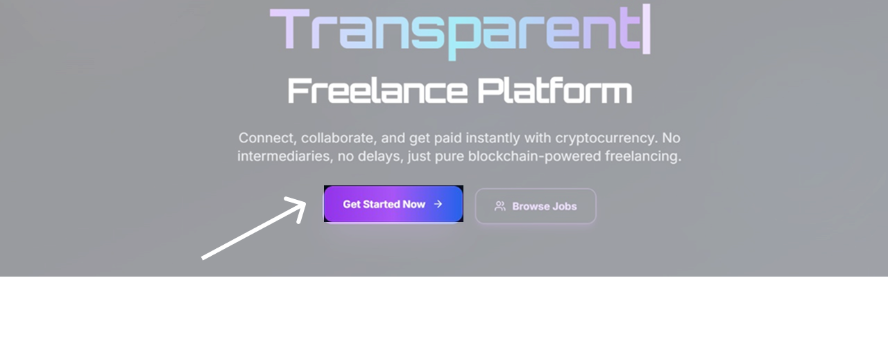
  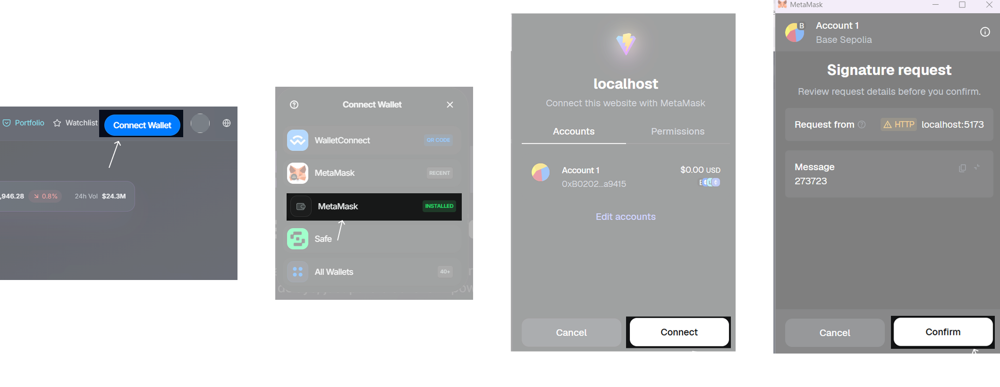
</p>  

---

### 2️⃣ Create Proposal / Job Posting  
Clients can create proposals or post jobs, setting project details, budgets, and requirements.  

<p align="center">
  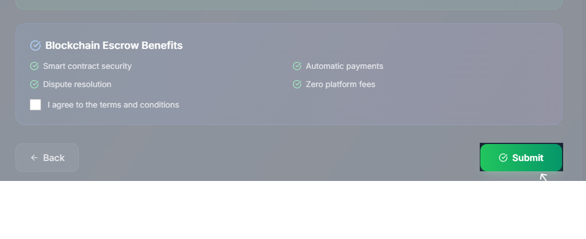
  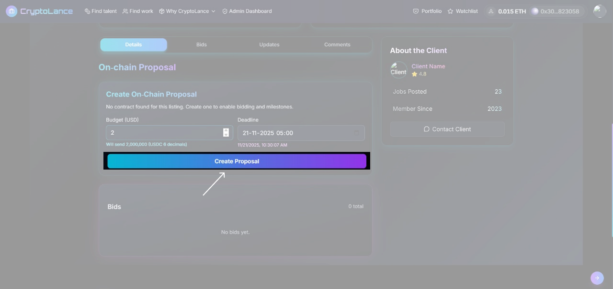
</p>  

---

### 3️⃣ Open for Bidding & Submit Bids  
Freelancers can view open projects and place bids using **HFT tokens**.  

<p align="center">
  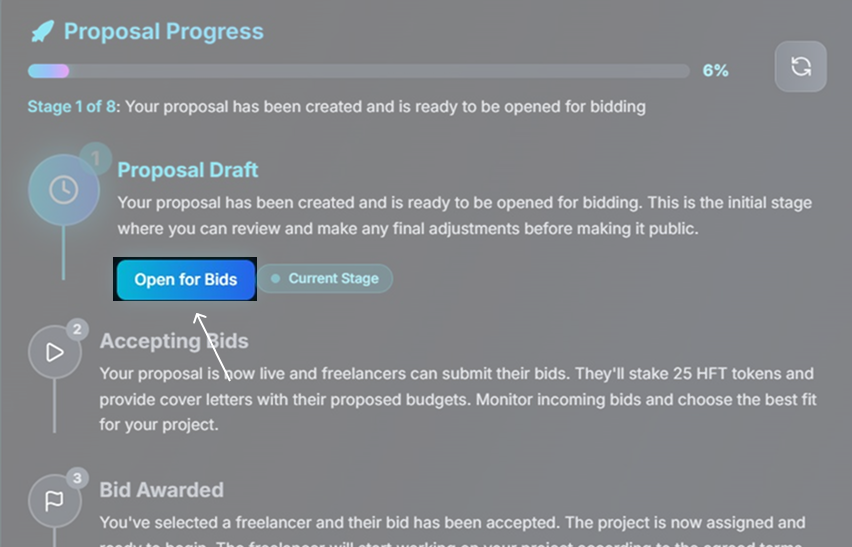
  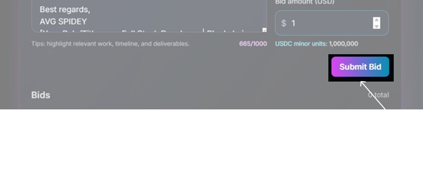
</p>  

---

### 4️⃣ Bid Acceptance & Budget Escrow  
Clients review bids, select the best freelancer, and escrow the **entire project budget** into the smart contract.  

<p align="center">
  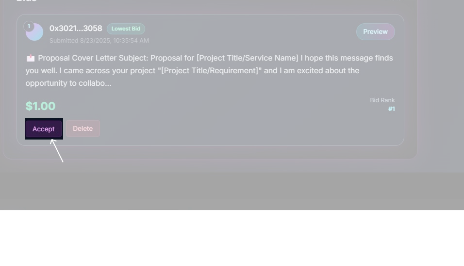
  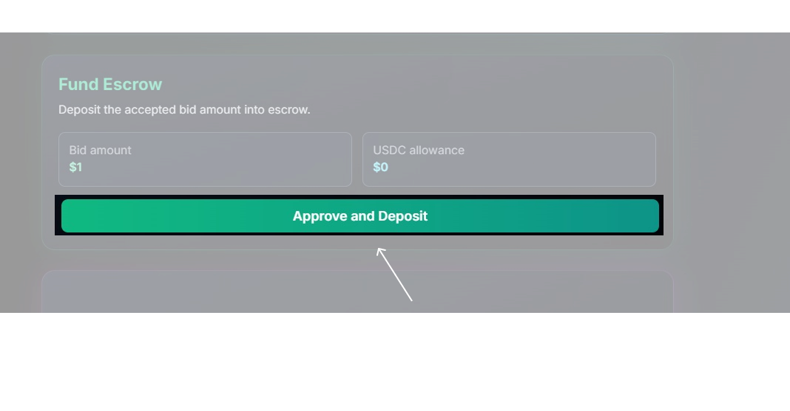
</p>  

---

### 5️⃣ Project Kickoff & Milestone Payments  
Freelancers start working once escrow is confirmed. Payments are released in secure milestones:  
- **40%** after first milestone approval  
- **70%** after second milestone approval  
- **100%** on final completion  

<p align="center">
  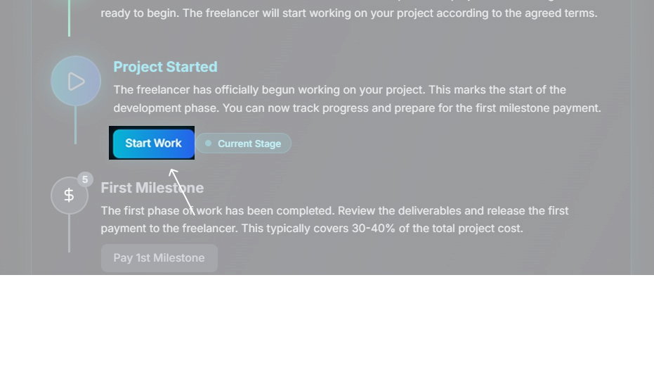
  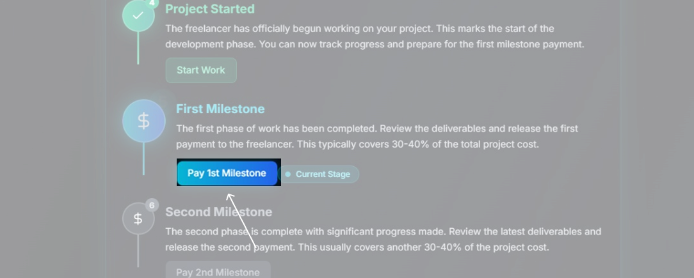
</p>  

<p align="center">
  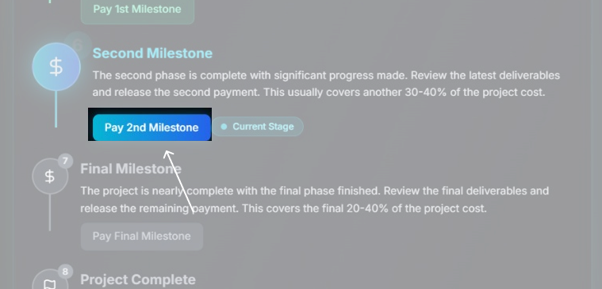
  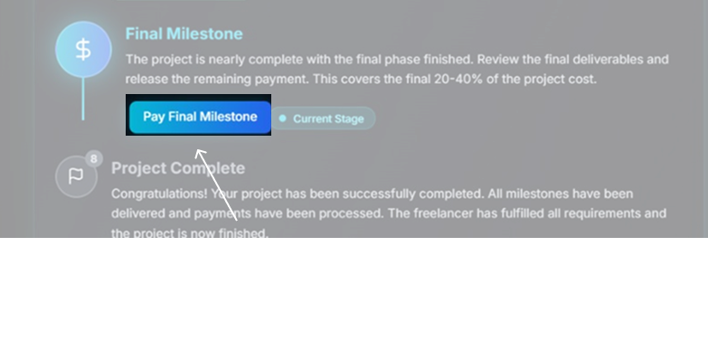
</p>  

---

### 6️⃣ Project Completion or Cancellation  
Once the work is fully completed and approved, the contract releases the final payment.  
In case of cancellation, funds are handled transparently through the smart contract.  

<p align="center">
  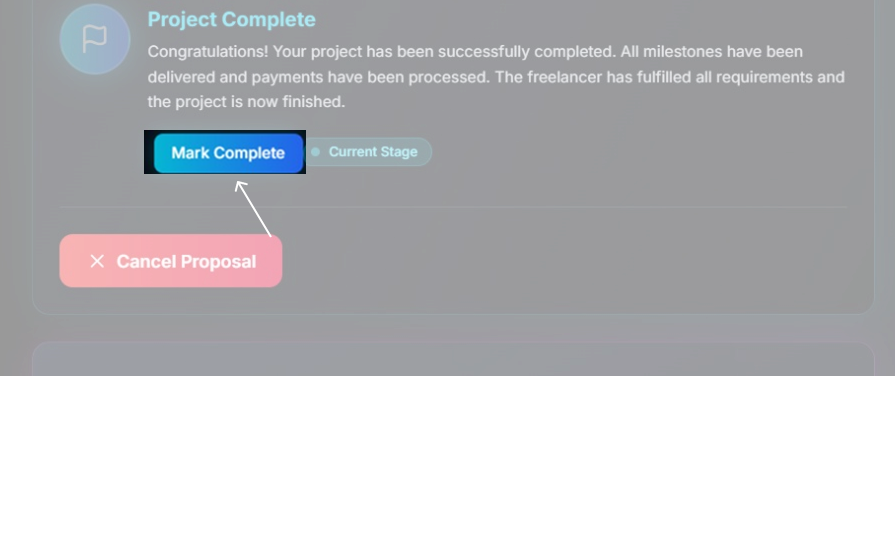
  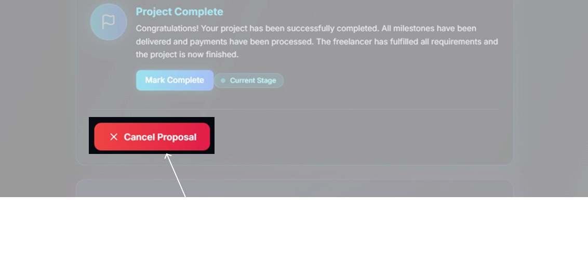
</p>  

---

### 7️⃣ Platform Fee  
A minimal **1% fee** is automatically deducted from the project budget and routed to the treasury contract.  
This sustains the platform while keeping costs fair for both freelancers and clients.  

---

---

### 🏦 Automated Platform Fee  
A minimal **1% fee** is automatically deducted from the job’s budget and routed to the **treasury contract**, ensuring sustainability without burdening freelancers.  

---

### 🪙 Token System  
- 🎁 **150 HFT tokens** are airdropped monthly to active users  
- 💸 **25 HFT tokens** are required per bid submission  
- 🛒 Additional tokens can be purchased at **150 HFT / 10 USDC**  

This tokenized bidding system ensures fairness and reduces spam bidding.  

---

### 📁 Portfolio & Gig Management  
Freelancers can **create and manage their gigs**, showcase completed projects, and build on-chain reputation, helping clients identify trusted professionals.  

---

### 🔍 Transparent On-Chain Activity  
All transactions, proposals, bids, and payments are recorded **directly on-chain**. Anyone can audit the activity, ensuring **fairness, trust, and accountability** across the ecosystem.  

---


***

## 📽️ Demo & Deliverables

- **Web App:** [CryptoLance_deployed_link](#)  
- **Demo Video:** [CryptoLance_YouTube_demo_link](#)  
- **Pitch Deck:** [CryptoLance_ppt_link](#)

***

## 🧪 How to Run the Project

### Requirements

- Node.js (v18+)
- MetaMask or supported wallet
- Hardhat/Foundry and testnet ETH

### Local Setup

#### Frontend

```bash
git clone https://github.com/{yourusername}/cryptolance
cd frontend
npm install
npm run dev
```

#### Deploying Contracts

```bash
cd contracts
forge script script/DeployAll.s.sol:DeployAll --private-key $your-private-key --rpc-url $rpc-url --broadcast -vvvvv
```

***

## 🦠 Future Scope

- Discord bot for job/trade notifications  
- Referral system for freelancers  
- Multi-chain job posting ( Base, etc.)  
- Advanced portfolio analytics  
- In-app messaging and dispute resolution module

***

## 📌 Resources / Credits

- OpenZepplin Contracts, Hardhat/Foundry  
- MetaMask, WalletConnect  ,RainbowKit

***

## 🏁 Final Words

CryptoLance empowers everyone—from solo devs to enterprise clients—to collaborate, work, and transact openly and securely. We’re excited to bring talent and opportunity to the blockchain—one gig at a time!

***

**CryptoLance—Decentralized Talent, Unstoppable Opportunity.**


